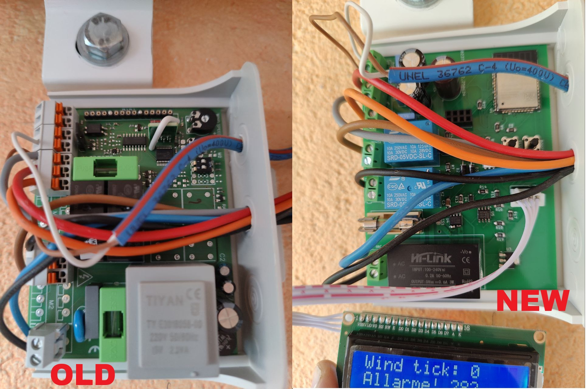
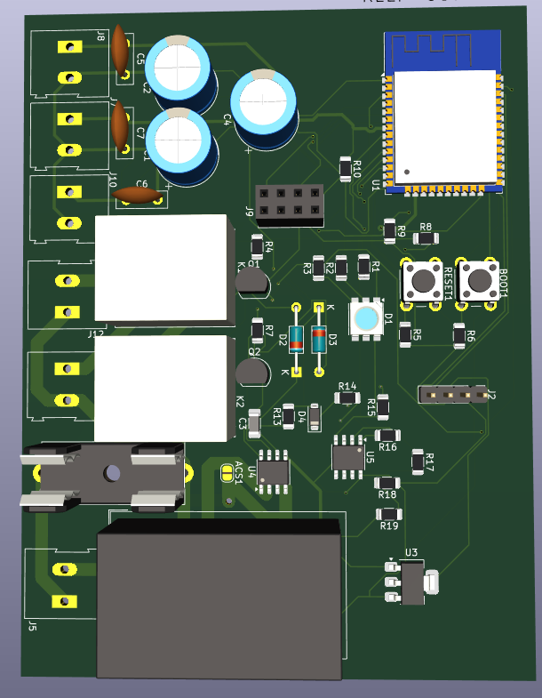

# Project Overview: Wind Alarm Awning Control Replacement System

This project was developed to replace a faulty awning control board that is triggered in case of high wind conditions. The system uses an anemometer to detect wind speed, and through a control board equipped with an onboard trimmer, it allows the user to set a wind speed threshold. Once this threshold is exceeded, the awning is automatically retracted to prevent wind damage.

## Original Control Board: Firmware Bug

The original board, while functional in normal conditions, presents a critical firmware issue. Below is a step-by-step breakdown of the standard operation and the bug scenario:

### Normal Operation:
1. The awning is lowered via manual or remote control.
2. The board executes the command and lowers the awning.
3. If wind speed exceeds the set threshold, the board retracts the awning and leaves it retracted.

### Bug Scenario:
1. The awning is lowered using the control commands.
2. The board properly lowers the awning.
3. Upon high wind detection, the board retracts the awning as expected.
4. While outside the building, the user manually lowers the awning using the crank handle.
5. The board does not detect that the awning was manually lowered.
6. If wind conditions worsen again, the board fails to retract the awning, leaving it exposed to damage.

## New Control Board: Fully Programmable and Wi-Fi Enabled

The replacement board is fully programmable, supporting both Arduino and ESP-IDF environments. This flexibility allows for quick and permanent fixes to firmware bugs like the one described above. Additionally, the board natively supports Wi-Fi connectivity for remote monitoring and updates.

## Advanced Features:

- **Current Sensor Integration:**  
  A current sensor is integrated directly on the board and connected to an ADC1 pin. This feature enables the system to control the awning opening to a specific percentage. Once programmed with a calibration sequence, the system can learn and control precise positions.

- **Debug and Display Capabilities:**
  - **Serial Interface:** For real-time debugging and logging.
  - **RGB LED:** Programmable for visual status indicators.
  - **LCD Display Support:** Allows the connection of an LCD screen to show system status and operational feedback.
  

